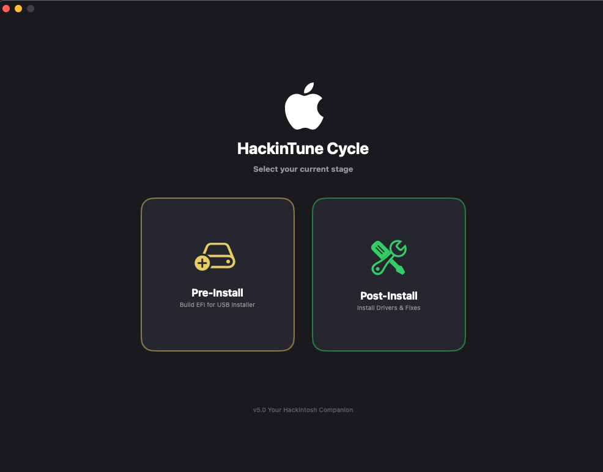
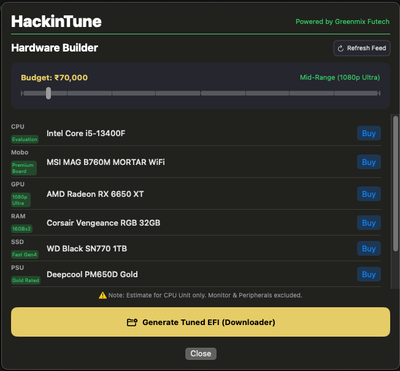
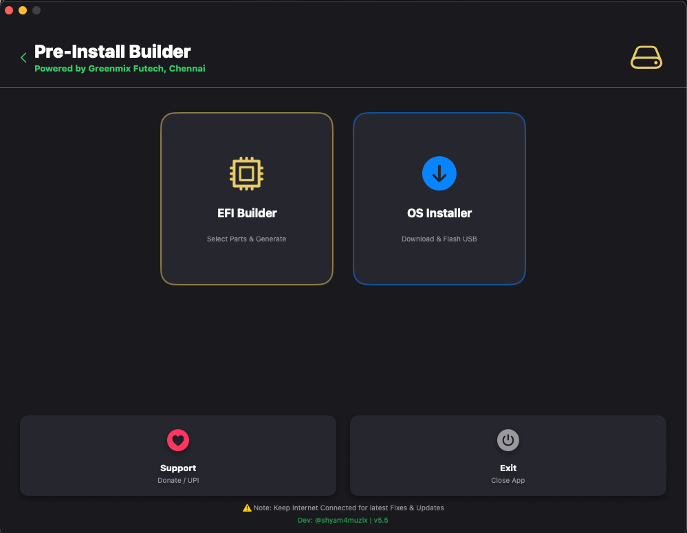
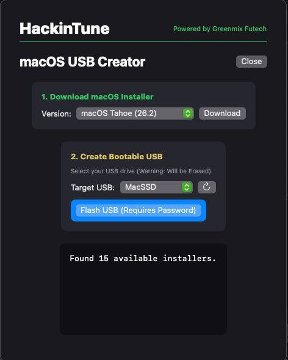

  

# 🍏 HackinTune: The Mighty Hackintosh Companion
**Smart Hardware Repair • Ultimate Performance • Premium Management**

**HackinTune** is a premium macOS native utility designed to simplify and supercharge the entire Hackintosh journey—from generating solid EFI builders to managing smart repairs on a running system.

  

---

## ⚡ Key Features

### 🏗️ Hackintosh Builder (Hardware Recommender)

*   **Budget-Dynamic Tiers**: Intelligent hardware selection ranging from ₹30,000 (Entry Level) to ₹6,00,000 (God Tier).
*   **Component Matching**: Balanced builds pairing Intel Core (10th-14th Gen) with natively supported AMD Radeon GPUs (RX 580 to RX 7900 XTX).
*   **Direct Purchase Links**: One-click "Buy" buttons that launch targeted Amazon search queries for every recommended component.
*   **Instant EFI Matching**: Generate a tuned OpenCore EFI folder specifically optimized for your selected hardware tier directly from the builder.

 

### 🔧 Post-Install: Smart Hardware Repair & Optimizer

*   **Robust EFI Mounting**: Improved auto-detection with admin privilege prompts and a manual partition picker.
*   **Freeze Analysis (Async)**: Background scanning of system logs to diagnose recent Kernel Panics and driver conflicts.
*   **Laptop Specific Support**: Intelligent detection of Laptop hardware with one-click injection for Battery and Trackpad fixes.
*   **SSD Health & TRIM**: Real-time S.M.A.R.T. status verification and one-click TRIM toggle.
*   **Safety Compatibility Guard**: Advanced logic that matches drivers to specific Vendor IDs. Incompatible injections are blocked to prevent system crashes.

 

### 🛠️ Pre-Install: EFI Builder & Setup Menu

*   **Smart EFI Builder**: Dynamically generates solid OpenCore EFI folders based on hardware selections.
*   **Solid Configurations**: Tailored SSDTs (e.g., `SSDT-PLUG-ALT` for 12th+ Gen) for a "perfect first boot."
*   **Dual-Path Flow**: Clearly separated workflows for creating an Installer and generating the final EFI.

 

### 💾 macOS Installer Creator

*   **Direct Apple Downloads**: Directly fetches official macOS versions from Apple's servers.
*   **One-Click Flashing**: Highly reliable USB creation tool with real-time logging and permission handling.
*   **Tahoe & Sequoia Support**: Optimized for the latest macOS versions including beta releases.

 

### 💎 Premium ToolBox (v1.1 Special)
*   **SMBIOS Manager**: Generate high-quality Serial Numbers, Board Serials, and UUIDs for any Mac model with one-click copying.
*   **SIP & Gatekeeper Manager**: Real-time status reporting and guidance on security configurations.
*   **GUI Boot-Arg Dashboard**: Effortlessly toggle common boot-args (`-v`, `debug`, `pikera`) without touching a Plist editor.
*   **Kext Update Checker**: Instantly check GitHub for the latest core kernel extensions (Lilu, WEG, AppleALC, VirtualSMC).
*   **EFI Vault**: Create compressed, timestamped backups of your working EFI directly to your Documents folder.

#### 🎨 Native Experience
- **Sleek UX**: Pure SwiftUI implementation with a fixed-size (1000x750) premium design and high-res icon pack installer.

---

## 📥 [Download Latest Release](https://github.com/sam4muzix/HackinTune/releases/latest/download/HackinTune_Native.zip)
*No terminal needed. Download, unzip, and run the native app!*

---

> [!IMPORTANT]
> **Safety First**: HackinTune automatically backs up your `config.plist` before any modification. Always keep a bootable recovery USB as a best practice for any Hackintosh surgery.

## 🤝 Support & Feedback
*   **GitHub Issues**: For bug reports and feature requests.
*   **Social**: Connect with the developer via [Instagram](https://www.instagram.com/shyam4muzix/) or [Email](mailto:shyam4muzix@gmail.com).

---
*© 2026 Powered by Greenmix Futech, Chennai*
